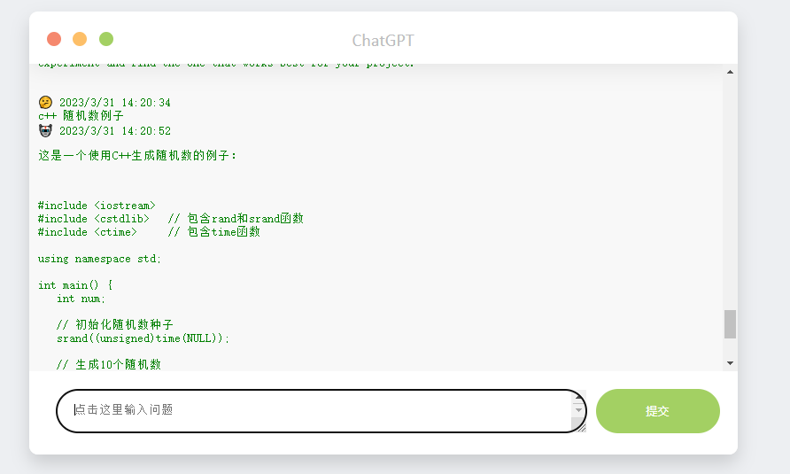

# chatgpt-html

## How to compile and start
```
export OPENAI_API_KEY=XXXX or config it to profile
git clone https://github.com/fantasy-peak/chatgpt-html.git
cd chatgpt-html
xmake build -v
xmake run chatgpt-html ../../../../cfg/chatgpt-html.yml

http://127.0.0.1:8085/chat
```

## picture
